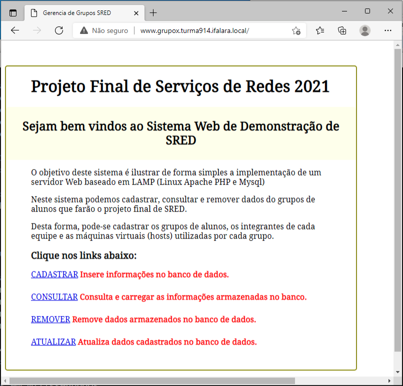
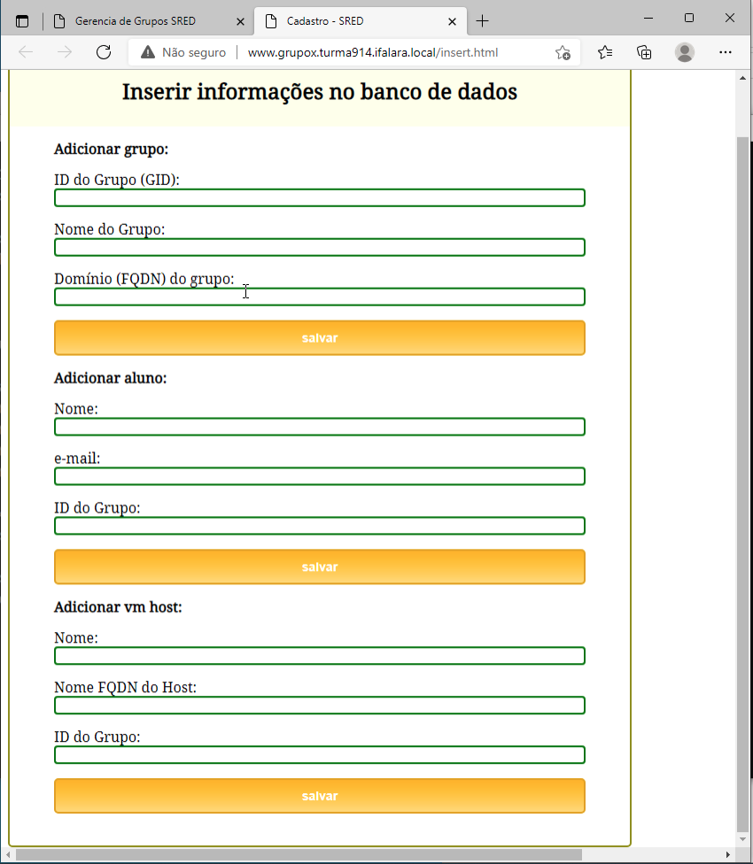
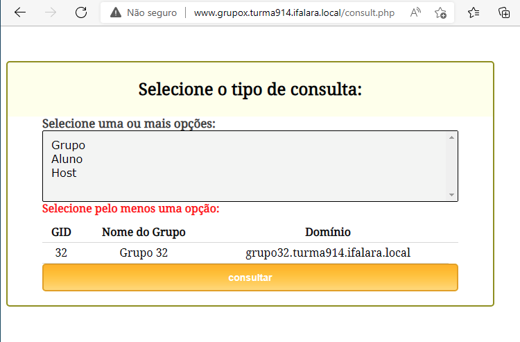
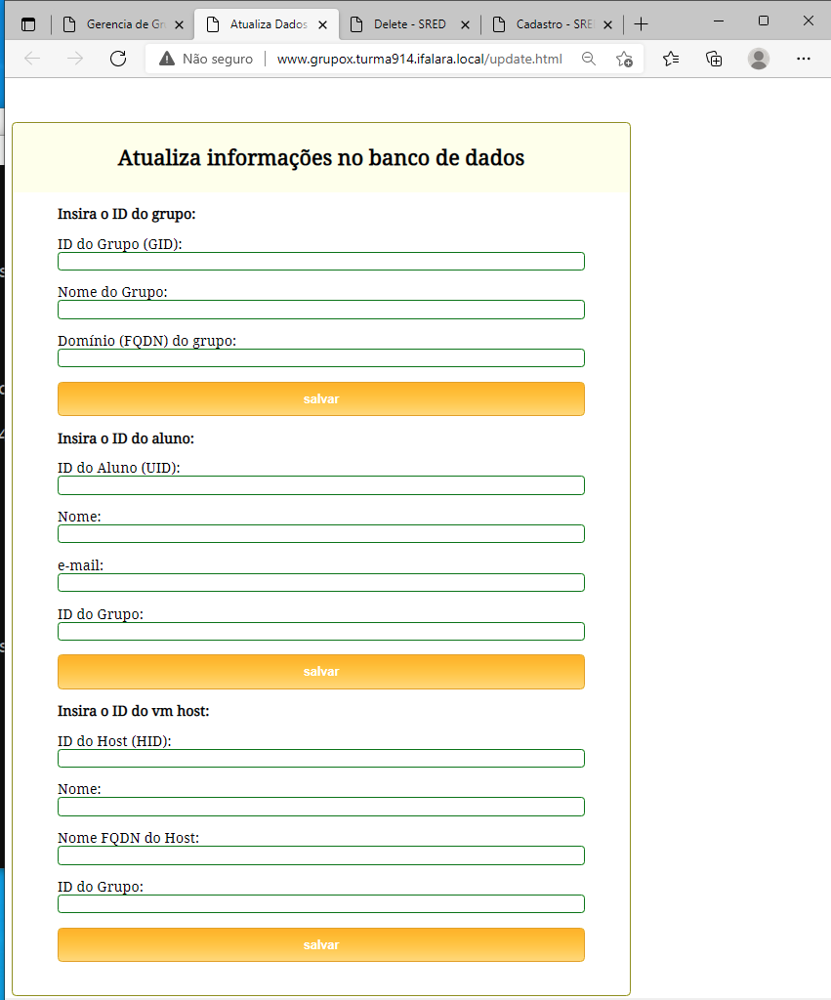

# Site Demo para Integração do Serviço LAMP

* Faça o download do [Site Demo](https://github.com/alaelson/labredes2021/blob/551391a34728b53de28b2251ae206b17bedc277d/network/lamp/siteDemo/www.grupox.turma914.ifalara.local.zip) após as configuração do [Virtual-Host](https://github.com/alaelson/labredes2021/blob/main/network/lamp/install/virtual-host.md) no apache e da [Configuração](https://github.com/alaelson/labredes2021/blob/main/network/lamp/install/mysql-server.md) e [Teste](https://github.com/alaelson/labredes2021/blob/main/network/lamp/install/createdatabase.md) do Servidor de Banco de dados.

* Depois basta descompactar todos os arquivos no seu diretório ``DocumentoRoot`` do site no servidor web.

### Alguns _Screen Shots_ do Site Demo:

* Home Page

 Figura 1: Execução do arquivo ``index.html`` no browser

   
   
* Cadastrar Dados 

 Figura 2: execução do arquivo ``insert.html`` no browser

   
   
* Consultar Dados

 Figura 3: execução do arquivo de consulta ``consult.php`` no browser

   
   
* Atualizar Dados

 Figura 4: execução do arquivo de atualização ``update.html`` no browser

   
   
* Deletar Dados

 Figura 5: execução do arquivo de atualização ``update.html`` no browser

   
   
