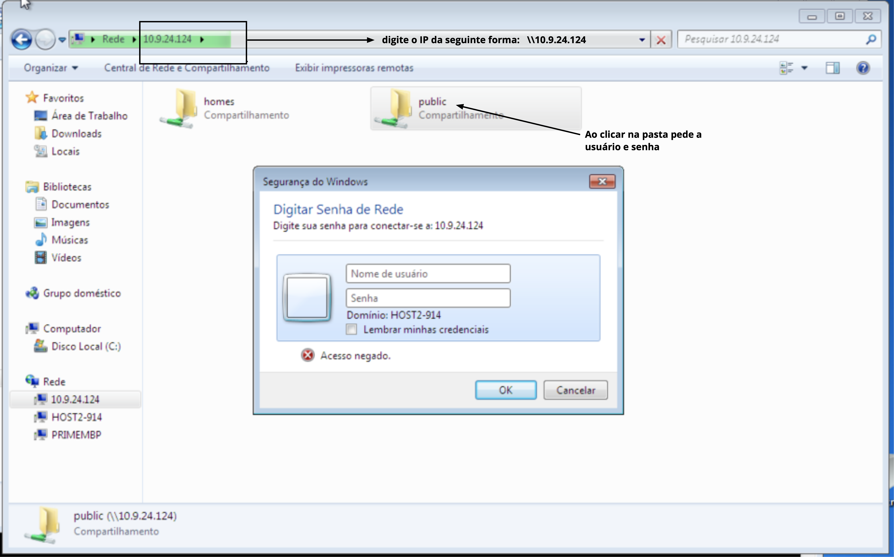

# Compartilhamento de arquivos com Samba

## Objetivo:

   * Configurar um servidor compartilhamento de arquivos usando o serviço Samba no linux
   * Acessar o **Gateway Server** via Putty no Windows e depois acessar os servidores **samba**.

https://ubuntu.com/tutorials/install-and-configure-samba#3-setting-up-samba

## Nome da máquina

```
Tabela 1: Exemplo de nomes dos servidores
-------------------------------------------------------------------------
|    Nome da VM     |                    NOME                           |
-------------------------------------------------------------------------
| Gateway (gw)      | gw.<aluno_turma>.labredes.ifalarapiraca.local     |
| Samba-SRV.        | samba.<aluno_turma>.labredes.ifalarapiraca.local  |
| NameServer1 (ns1) | ns1.<aluno_turma>.labredes.ifalarapiraca.local    |
| NameServer2 (ns2) | ns2.<aluno_turma>.labredes.ifalarapiraca.local    |
-------------------------------------------------------------------------
```

Conferir os nomes das MV conforme a Tabela 1. Editar o nome da máquina

```bash
$ sudo hostnamectl set-hostname samba-srv
$ reboot
```
OBS: após o reboot o nome da máquina aparecerá no prompt do shell

## Passo-a-passo:

```
Tabela 2: Definições da rede interna da turma 914
--------------------------------
|  DESCRICAO  |  IP            |
--------------------------------
| rede        | 10.9.14.0      |
| máscara     | 255.255.255.0  |
| Gateway     | 10.9.14.1      |
| Samba-SRV   | 10.9.14.5      |
| NameServer1 | 10.9.14.10     |
| NameServer2 | 10.9.14.11     |
--------------------------------
```

```
Tabela 3: Definições da rede interna da turma 924
--------------------------------
|  DESCRICAO  |  IP            |
--------------------------------
| rede        | 10.9.24.0      |
| máscara     | 255.255.255.0  |
| Gateway     | 10.9.24.1      |
| Samba-SRV   | 10.9.24.5      |
| NameServer1 | 10.9.24.10     |
| NameServer2 | 10.9.24.11     |
--------------------------------
```
    1. Definir o IP da rede interna para o Samba-SRV

```bash
$ sudo nano /etc/netplan/00-installer-config.yaml
```

```
network:
    ethernets:
        enp0s3:
            addresses: [10.9.24.5/24]
            gateway4: 10.9.24.1
            dhcp4: false 
    version: 2
```

```bash
$ sudo netplan apply
$ ifconfig -a
$ ping 10.9.24.1
```

   2. Na máquina Host faça login via ssh (Use Putty no Windows ou o Terminal no Linux)

Exemplo: $ ssh usuário@ipremoto

```bash
$ ssh administrador@10.9.24.5
```

   3. instalar o servidor samba na MV samba-srv

```bash
$ sudo apt update
$ sudo apt install samba
```
   
   4. Verfificar se o samba está rodando

```bash
$ whereis samba
samba: /usr/sbin/samba /usr/lib/x86_64-linux-gnu/samba /etc/samba /usr/share/samba /usr/share/man/man8/samba.8.gz /usr/share/man/man7/samba.7.gz


$ sudo systemctl status smbd
● smbd.service - Samba SMB Daemon
     Loaded: loaded (/lib/systemd/system/smbd.service; enabled; vendor preset: enabled)
     Active: active (running) since Mon 2021-03-22 23:07:17 UTC; 1h 26min ago
       Docs: man:smbd(8)
             man:samba(7)
             man:smb.conf(5)
    Process: 691 ExecStartPre=/usr/share/samba/update-apparmor-samba-profile (code=exited, status=0/SUCCESS)
   Main PID: 697 (smbd)
     Status: "smbd: ready to serve connections..."
      Tasks: 4 (limit: 460)
     Memory: 17.5M
     CGroup: /system.slice/smbd.service
             ├─697 /usr/sbin/smbd --foreground --no-process-group
             ├─737 /usr/sbin/smbd --foreground --no-process-group
             ├─738 /usr/sbin/smbd --foreground --no-process-group
             └─739 /usr/sbin/smbd --foreground --no-process-group

```

```bash
$ netstat -an | grep LISTEN
tcp        0      0 0.0.0.0:445             0.0.0.0:*               LISTEN     
tcp        0      0 0.0.0.0:139             0.0.0.0:*               LISTEN   
```

    5. Faça o backup do arquivo de configuração do samba e cria um arquivo novo somente com os comandos necessários.
    
```bash
$ sudo cp /etc/samba/smb.conf{,.backup}
$ ls -la
-rw-r--r--  1 root root 8942 Mar 22 20:55 smb.conf
-rw-r--r--  1 root root 8942 Mar 23 01:42 smb.conf.backup
$
$ sudo bash -c 'grep -v -E "^#|^;" /etc/samba/smb.conf.backup | grep . > /etc/samba/smb.conf'
```

```bash
$ sudo nano /etc/samba/smb.conf
[global]
   workgroup = WORKGROUP
   server string = %h server (Samba, Ubuntu)
   log file = /var/log/samba/log.%m
   max log size = 1000
   logging = file
   panic action = /usr/share/samba/panic-action %d
   server role = standalone server
   obey pam restrictions = yes
   unix password sync = yes
   passwd program = /usr/bin/passwd %u
   passwd chat = *Enter\snew\s*\spassword:* %n\n *Retype\snew\s*\spassword:* %n\n *password\supdated\ssuccessfully* .
   pam password change = yes
   map to guest = bad user
   usershare allow guests = yes
[printers]
   comment = All Printers
   browseable = no
   path = /var/spool/samba
   printable = yes
   guest ok = no
   read only = yes
   create mask = 0700
[print$]
   comment = Printer Drivers
   path = /var/lib/samba/printers
   browseable = yes
   read only = yes
   guest ok = no
```


  
  
  6. Edite o arquivo de configuração /etc/samba/smb.conf

	* adicione as interfaces da sua máquina na linha "interfaces = 127.0.0.1/8 enp0s3", separando os nomes das interfaces por espaços.
  
```bash
sudo nano /etc/samba/smb.conf
[global]
   workgroup = WORKGROUP
   netbios name = samba-srv
   security = user
   server string = %h server (Samba, Ubuntu)
   interfaces = 127.0.0.1/8 enp0s3
   bind interfaces only = yes
   log file = /var/log/samba/log.%m
   max log size = 1000
   logging = file
   panic action = /usr/share/samba/panic-action %d
   server role = standalone server
   obey pam restrictions = yes
   unix password sync = yes
   passwd program = /usr/bin/passwd %u
   passwd chat = *Enter\snew\s*\spassword:* %n\n *Retype\snew\s*\spassword:* %n\n *password\supdated\ssuccessfully* .
   pam password change = yes
   map to guest = bad user
   usershare allow guests = yes
[printers]
   comment = All Printers
   browseable = no
   path = /var/spool/samba
   printable = yes
   guest ok = no
   read only = yes
   create mask = 0700
[print$]
   comment = Printer Drivers
   path = /var/lib/samba/printers
   browseable = yes
   read only = yes
   guest ok = no
[homes]
   comment = Home Directories
   browseable = yes
   read only = no
   create mask = 0700
   directory mask = 0700
   valid users = %S
[public]
   comment = public anonymous access
   path = /samba/public
   browsable =yes
   create mask = 0660
   directory mask = 0771
   writable = yes
   guest ok = yes
   guest only = yes
   force user = nobody
   force create mode = 0777
   force directory mode = 0777
```
    * Renicie o serviço smbd
    
```bash
$ sudo systemctl restart smbd
```

   * modifica a pasta /samba/public para acesso a somente usuários do grupo sambashare
   
```bash
[public]
   comment = public anonymous access
   path = /samba/public
   browsable =yes
   create mask = 0660
   directory mask = 0771
   writable = yes
   guest ok = no
   valid users = @sambashare
   #guest only = yes
   #force user = nobody
   #force create mode = 0777
   #force directory mode = 0777
```

    * Crie um usuário do S.O para que possa utilizar o compartilhamento samba:
    * usuário: aluno
    * senha: alunoifal
    
```bash
$ sudo adduser aluno
Adding user `aluno' ...
Adding new group `aluno' (1001) ...
Adding new user `aluno' (1001) with group `aluno' ...
Creating home directory `/home/aluno' ...
Copying files from `/etc/skel' ...
New password: 
Retype new password: 
passwd: password updated successfully
Changing the user information for aluno
Enter the new value, or press ENTER for the default
	Full Name []: Aluno de SRED no IFAL Arapiraca
	Room Number []: 
	Work Phone []: 
	Home Phone []: 
	Other []: 
Is the information correct? [Y/n] y
```
    * É necessário vincular o usuário do S.O. ao Serviço Samba. Repita a senha de aluno ou crie uma senha nova somente para acessar o compartilhamento de arquivo. Neste caso repetiremos a senha do usuário aluno
    
```bash
$ sudo smbpasswd -a aluno
New SMB password:
Retype new SMB password:
Added user aluno.

$ sudo usermod -aG sambashare aluno

```
    
    * O Samba já está instalado, agora precisamos criar um diretório para compartilhá-lo em rede.
   
```bash
$ mkdir /home/<username>/sambashare/
$ sudo mkdir -p /samba/public
```
    * configure as permissões para que qualquer um possa acessar o compartilhamento público.

```bash
sudo chown -R nobody:nogroup /samba/public
sudo chmod -R 0775 /samba/public
sudo chgrp sambashare /samba/public

```
   7. Cliente do compartilhamento:
   
    * Em um máquina com Windows (também pode usar linux os MacOS) digite no Winndows Explorer o endereço IP do servidor samba da seguinte forma:
    **\\ip_do_maquina**. Exemplo: \\10.9.24.124
    
   <p><center> Figura 1: Tela do Windows Explorer com o acesso ao recurso compartilhado.</center></p>   
    


## Referências

    1. https://ubuntu.com/tutorials/install-and-configure-samba#1-overview
    2. https://websiteforstudents.com/install-samba-on-ubuntu-20-04-18-04/
    3. https://linuxconfig.org/how-to-configure-samba-server-share-on-ubuntu-20-04-focal-fossa-linux
    4. https://www.techrepublic.com/article/how-to-create-a-samba-share-on-ubuntu-server-20-04/
    5. https://help.ubuntu.com/community/Samba/SambaServerGuide?_ga=2.233364766.1651094097.1616438807-722741666.1614875855

